# iacmp — Multi-Platform IaC

> 🇧🇷 [Versão em português](README.md)

An infrastructure-as-code CLI that generates **CloudFormation (AWS), Bicep (Azure) and Terraform (GCP)** from the same TypeScript constructs — with deploy, destroy, diff, audits and diagrams in a single flow.



```typescript
import { Stack, Fn, Database, ref } from '@iacmp/core';

const stack = new Stack('ApiStack');

new Database.DynamoDB(stack, 'ItemsTable', { partitionKey: 'id' });

new Fn.Lambda(stack, 'ItemsFn', {
  runtime: 'nodejs20',
  handler: 'index.handler',
  code: 'dist/handlers/items',
  environment: { TABLE_NAME: ref('ItemsTable', 'Name') },
});

export default stack;
```

```bash
iacmp synth --provider aws      # → CloudFormation
iacmp synth --provider azure    # → Bicep (single deployment via _main.bicep)
iacmp synth --provider gcp      # → Terraform (tf.json)
iacmp synth --provider aws --format tf    # → AWS via Terraform
iacmp deploy                    # deploys for real, to your account
```

## Why iacmp



- **Validated by real deploys, not just synth.** Every provider went through a battery of 20 end-to-end scenarios (deploy → runtime test → destroy) on real AWS, Azure and GCP accounts. Dozens of bugs that only show up in a real cloud — ARM ordering, quotas, service-account IAM, Redis TLS, VPC peering — were found and fixed in the tool.
- **One construct, three clouds.** `Database.SQL` becomes RDS on AWS, PostgreSQL Flexible Server on Azure and Cloud SQL (with private service access) on GCP — with the correct network, password and SSL wiring on each.
- **Cloud-agnostic runtime.** Handlers use the [`@iacmp/runtime`](packages/runtime) facade (`table()`, `blob()`, `queue()`, `sql()`, `secret()`) — the same handler code runs on Lambda, Azure Functions and Cloud Functions.
- **Synth-time guards.** More than a dozen validations catch, in seconds, mistakes that would cost you a deploy: a handler reading an env var the stack never declares, a Lambda in a VPC without a gateway endpoint, SQL without SSL against RDS, an undeclared GSI, and more.

## Provider status

| Provider | Format | Coverage |
|---|---|---|
| `aws` | CloudFormation | 20/20 e2e battery scenarios |
| `azure` | Bicep (Deployment Stacks) | 20/20 scenarios |
| `gcp` | Terraform (tf.json) | 20/20 scenarios |
| `aws --format tf` / `azure --format tf` | Terraform | validated by real deploys |

## Install

```bash
npm install -g iacmp
```

**Requirements:** Node.js 20+. For deploys: the target cloud's CLI (`aws`, `az` or `gcloud`) and, for the Terraform paths, the `terraform` binary. `iacmp doctor` checks everything.

## Quick start

```bash
iacmp init my-project --template serverless
cd my-project

iacmp synth                 # generates templates + validations
iacmp diagram               # architecture diagram (Structurizr/Mermaid)
iacmp audit-all             # security, HA and DR audits
iacmp deploy                # real deploy (with confirmations)
iacmp diff                  # what would change on the next deploy
iacmp destroy               # removes everything (with confirmation)
```

## Commands

| Command | Description |
|---|---|
| `init` | Creates a project (templates: blank, hello, rds, webapp, network, serverless, fullstack) |
| `synth` | Synthesizes stacks to the provider's format (+ validation via the cloud CLI) |
| `deploy` / `destroy` | Real deploy and destroy, dependency-ordered, with confirmations |
| `diff` | Difference between the current synth and what is deployed |
| `diagram` | C4 diagrams (Structurizr DSL or Mermaid) from the stacks |
| `audit` / `audit-all` | Security, high-availability and DR audits |
| `doctor` | Environment diagnostics (CLIs, credentials, versions) |
| `registry` | Catalog of constructs and examples |
| `setup` | Registers the embedded MCP server in Claude Code and Claude Desktop |
| `ai` / `from-diagram` | AI generation (part of **iacmp Pro** — see below) |

## Stack organization

One stack per domain (network, data, compute…), wired by cross-stack `ref()`:

```
stacks/
  network/api-stack.ts      # Fn.ApiGateway
  compute/fn-stack.ts       # Fn.Lambda
  database/db-stack.ts      # Database.DynamoDB
src/handlers/…              # TypeScript handlers (@iacmp/runtime facade)
```

The synth resolves references to the right mechanism for each cloud: Export/ImportValue in CloudFormation, symbolic module references in Bicep, direct resource references in Terraform.

## Claude Code out of the box

iacmp embeds an MCP server. One command registers the tools in Claude Code and Claude Desktop:

```bash
iacmp setup
```

The agent gets `write_stack`, `synth_project`, `deploy_project`, `destroy_project`, `validate_stack` and `read_synth_output` — structured calls to write stacks and operate the CLI, all local, no embedded AI. `iacmp init` also generates a `CLAUDE.md` in the project that guides any agent through the right flow (write stack → `iacmp synth` until green), with or without MCP.

## iacmp Pro

AI generation (`iacmp ai`, `from-diagram`) and corpus search over MCP (`search_examples`/`list_examples`) are part of **iacmp Pro**: a corpus of examples where every pattern was validated by real deploys on the three clouds, served through RAG to the generator. The open CLI works 100% without it — Pro commands simply report the absence.

## Documentation

Docs are currently in Portuguese: [User manual](docs/manual-de-uso.md) · [Constructs (AWS ↔ Azure ↔ GCP table)](docs/constructs.md) · [Providers](docs/providers.md) · [Internal architecture](docs/arquitetura.md) · [FAQ](docs/faq.md) · [Changelog](docs/changelog.md)

## Contributing

See [CONTRIBUTING.md](CONTRIBUTING.md). Issues and PRs in English or Portuguese are welcome.

## License

[Apache-2.0](LICENSE).
