<p align="center"></p>

# iacmp — IaC Multi Plataforma

> 🇺🇸 [English version](README.en.md)

CLI de infraestrutura como código que gera **CloudFormation (AWS), Bicep (Azure) e Terraform (GCP)** a partir dos mesmos constructs TypeScript — com deploy, destroy, diff, auditoria e diagramas no mesmo fluxo.



```typescript
import { Stack, Fn, Database, ref } from '@iacmp/core';

const stack = new Stack('ApiStack');

new Database.DynamoDB(stack, 'ItemsTable', { partitionKey: 'id' });

new Fn.Lambda(stack, 'ItemsFn', {
  runtime: 'nodejs20',
  handler: 'index.handler',
  code: 'dist/handlers/items',
  environment: { TABLE_NAME: ref('ItemsTable', 'Name') },
});

export default stack;
```

```bash
iacmp synth --provider aws      # → CloudFormation
iacmp synth --provider azure    # → Bicep (deployment único via _main.bicep)
iacmp synth --provider gcp      # → Terraform (tf.json)
iacmp synth --provider aws --format tf    # → AWS via Terraform
iacmp deploy                    # deploya de verdade, na sua conta
```

## Por que iacmp



- **Validado em deploy real, não só em synth.** Cada provider passou por uma bateria de 20 cenários ponta a ponta (deploy → teste de runtime → destroy) em contas reais de AWS, Azure e GCP. Dezenas de bugs que só aparecem na nuvem de verdade — ordering do ARM, quotas, IAM de service accounts, TLS de Redis, peering de VPC — foram encontrados e corrigidos na ferramenta.
- **Um construct, três nuvens.** `Database.SQL` vira RDS na AWS, PostgreSQL Flexible Server no Azure e Cloud SQL (com private service access) no GCP — com as amarrações corretas de rede, senha e SSL em cada uma.
- **Runtime agnóstico.** Os handlers usam a facade [`@iacmp/runtime`](packages/runtime) (`table()`, `blob()`, `queue()`, `sql()`, `secret()`) — o mesmo código roda em Lambda, Azure Functions e Cloud Functions.
- **Guards de synth-time.** Mais de uma dúzia de validações barram em segundos erros que custariam um deploy: handler sem env var declarada, Lambda em VPC sem gateway endpoint, SQL sem SSL contra RDS, GSI não declarado, e outros.

## Status dos providers

| Provider | Formato | Cobertura |
|---|---|---|
| `aws` | CloudFormation | 20/20 cenários da bateria e2e |
| `azure` | Bicep (Deployment Stacks) | 20/20 cenários |
| `gcp` | Terraform (tf.json) | 20/20 cenários |
| `aws --format tf` / `azure --format tf` | Terraform | deploy real validado |

## Instalação

```bash
npm install -g iacmp
```

**Requisitos:** Node.js 20+. Para deploy: CLI da nuvem alvo (`aws`, `az` ou `gcloud`) e, para os caminhos Terraform, o binário `terraform`. `iacmp doctor` confere tudo.

## Uso rápido

```bash
iacmp init meu-projeto --template serverless
cd meu-projeto

iacmp synth                 # gera os templates + validações
iacmp diagram               # diagrama da arquitetura (Structurizr/Mermaid)
iacmp audit-all             # auditoria de segurança, HA e DR
iacmp deploy                # deploy real (com confirmações)
iacmp diff                  # o que mudaria num próximo deploy
iacmp destroy               # remove tudo (com confirmação)
```

## Comandos

| Comando | Descrição |
|---|---|
| `init` | Cria um projeto (templates: blank, hello, rds, webapp, network, serverless, fullstack) |
| `synth` | Sintetiza as stacks para o formato do provider (+ validação via CLI da nuvem) |
| `deploy` / `destroy` | Deploy e destroy reais, com ordenação por dependência e confirmações |
| `diff` | Diferença entre o synth atual e o que está deployado |
| `diagram` | Diagramas C4 (Structurizr DSL ou Mermaid) a partir das stacks |
| `audit` / `audit-all` | Auditorias de segurança, alta disponibilidade e DR |
| `doctor` | Diagnóstico do ambiente (CLIs, credenciais, versões) |
| `registry` | Catálogo de constructs e exemplos |
| `setup` | Registra o servidor MCP embutido no Claude Code e no Claude Desktop |
| `ai` / `from-diagram` | Geração via IA (parte do **iacmp Pro** — ver abaixo) |

## Organização das stacks

Uma stack por domínio (rede, dados, compute…), ligadas por `ref()` cross-stack:

```
stacks/
  network/api-stack.ts      # Fn.ApiGateway
  compute/fn-stack.ts       # Fn.Lambda
  database/db-stack.ts      # Database.DynamoDB
src/handlers/…              # handlers TypeScript (facade @iacmp/runtime)
```

O synth resolve as referências para o mecanismo certo de cada nuvem: Export/ImportValue no CloudFormation, referência simbólica de módulo no Bicep, referência direta de recurso no Terraform.

## Claude Code integrado de fábrica

O iacmp embute um servidor MCP. Um comando registra as ferramentas no Claude
Code e no Claude Desktop:

```bash
iacmp setup
```

O agente ganha `write_stack`, `synth_project`, `deploy_project`,
`destroy_project`, `validate_stack` e `read_synth_output` — chamadas
estruturadas para escrever stacks e operar o CLI, todas locais e sem IA
embutida. O `iacmp init` também gera um `CLAUDE.md` no projeto que orienta
qualquer agente a usar o fluxo correto (escrever stack → `iacmp synth` até
passar), com ou sem MCP.

## iacmp Pro

A geração via IA (`iacmp ai`, `from-diagram`) e a busca no corpus pelo MCP
(`search_examples`/`list_examples`) são parte do **iacmp Pro**: um corpus de
exemplos em que cada padrão foi validado em deploy real nas três nuvens,
servido por RAG para a geração. O CLI aberto funciona 100% sem ele — os
comandos Pro apenas indicam a ausência.

## Documentação

[Manual de uso](docs/manual-de-uso.md) · [Constructs (tabela AWS ↔ Azure ↔ GCP)](docs/constructs.md) · [Providers](docs/providers.md) · [Arquitetura interna](docs/arquitetura.md) · [FAQ](docs/faq.md) · [Changelog](docs/changelog.md)

## Contribuindo

Veja [CONTRIBUTING.md](CONTRIBUTING.md) e [docs/contribuindo.md](docs/contribuindo.md). Issues e PRs em português ou inglês são bem-vindos.

## Licença

[Apache-2.0](LICENSE).
