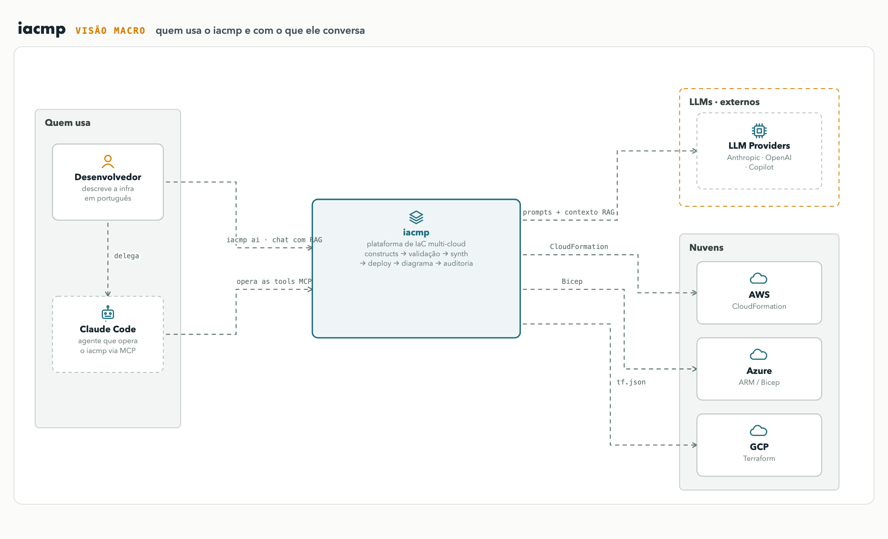
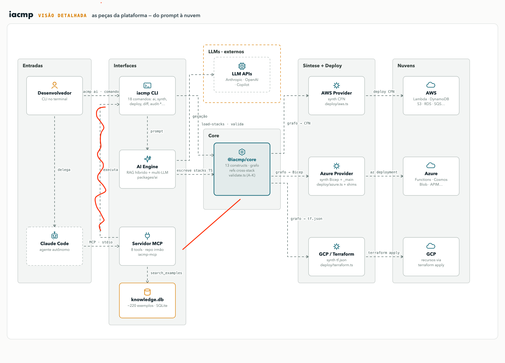
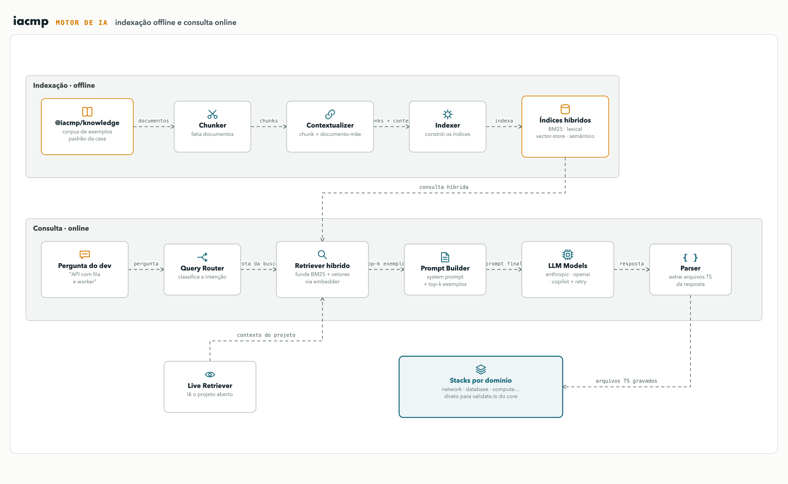
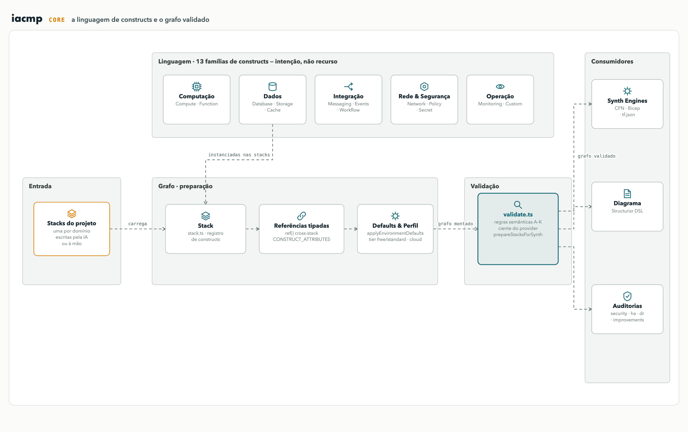

# Publicação LinkedIn — iacmp

> Cole o texto abaixo no LinkedIn. Anexe as 3 imagens abaixo (nesta ordem) — ou grave a navegação do diagrama interativo como vídeo.

## Diagramas (anexos do post)

**Visão macro** · quem usa e com o que conversa

**Visão detalhada** · as peças da plataforma, do prompt à nuvem

**Motor de IA** · indexação offline e consulta online

**Core** · a linguagem de constructs e o grafo validado (opcional — 4ª imagem para público mais técnico)

> Versão interativa/animada (para gravar em vídeo): abas Visão macro / Visão detalhada / Motor de IA, fluxo animado e hover que isola conexões — artifact "iacmp — Arquitetura C4".

---

Nos últimos meses venho construindo o iacmp: uma plataforma que compila intenção em infraestrutura.

Você descreve o sistema em português — "uma API de tarefas com fila, worker e banco" — e a plataforma escreve a infraestrutura como código, valida, provisiona e desenha a arquitetura. Na AWS, no Azure ou no GCP, a partir do mesmo código.

Como funciona (diagramas nos anexos, do panorama ao detalhe):

→ Dois front-ends de IA: um chat com RAG no terminal e um agente autônomo via MCP (Model Context Protocol), que opera a plataforma de ponta a ponta — pesquisa exemplos, escreve as stacks, faz synth, deploy e teste funcional.

→ Um núcleo agnóstico: 13 famílias de constructs descrevem intenção ("quero uma tabela chave-valor"), não recurso. Tudo converge para um único grafo, com validação semântica antes de qualquer gasto de nuvem.

→ Três back-ends de síntese: o mesmo grafo vira CloudFormation na AWS, Bicep no Azure e Terraform no GCP. Trocar de nuvem é trocar de back-end, não reescrever a infra.

O que mais me orgulha não é a geração — é a disciplina em volta dela:

- A IA aprende com uma base de ~220 exemplos curados, não improvisa padrão de projeto.
- Validação semântica barra o erro antes do synth; auditoria e diff barram antes do deploy.
- Cada versão é validada por bateria de deploys reais nas duas clouds: provisiona de verdade, testa o CRUD de verdade, destrói e deixa a conta limpa. A última bateria fechou 10/10.
- Bug encontrado em deploy vira correção na ferramenta — nunca remendo no template gerado.

Infraestrutura como código sempre teve um custo de entrada alto e um custo de troca de nuvem maior ainda. A aposta do iacmp é atacar os dois com o mesmo desenho: uma linguagem de constructs no meio, IA nas pontas.

Feito com Node.js, TypeScript e Claude. Diagramas gerados a partir da arquitetura real do projeto.

#InfrastructureAsCode #IaC #MultiCloud #AWS #Azure #GCP #IA #GenAI #MCP #DevOps #PlatformEngineering #TypeScript

---

## Variação curta (se preferir um post mais enxuto)

E se descrever a infraestrutura em português fosse o suficiente?

É a aposta do iacmp, plataforma que venho construindo: você descreve o sistema, a IA escreve constructs agnósticos de nuvem, e três back-ends emitem CloudFormation (AWS), Bicep (Azure) e Terraform (GCP) — do mesmo grafo, com validação semântica, deploy, diagrama e auditoria no mesmo fluxo.

Sem template escrito à mão. Sem reescrever a infra para trocar de nuvem.

E com disciplina de engenharia em volta da IA: base de ~220 exemplos curados guiando a geração, portões de validação antes de cada gasto, e bateria de deploys reais nas duas clouds a cada versão — a última fechou 10/10.

Os diagramas nos anexos mostram a arquitetura em três níveis: a visão macro, a visão detalhada e o motor de IA por dentro.

#IaC #MultiCloud #GenAI #DevOps #PlatformEngineering

---

## Dicas para a publicação

1. **Anexos**: grave a tela navegando pelos 3 níveis do diagrama (visão macro → visão detalhada → motor de IA, com o hover isolando conexões) — vídeo curto performa melhor que imagem estática no LinkedIn. Alternativa: as 3 imagens acima, na ordem.
2. **Primeira linha é o gancho**: o LinkedIn corta o texto após ~3 linhas ("ver mais"). As duas versões acima já abrem com o gancho.
3. **Horário**: terça a quinta, início da manhã, costuma ter melhor alcance para conteúdo técnico.
4. Se alguém pedir link/demo nos comentários, é um bom lugar para medir interesse antes de abrir o projeto.
