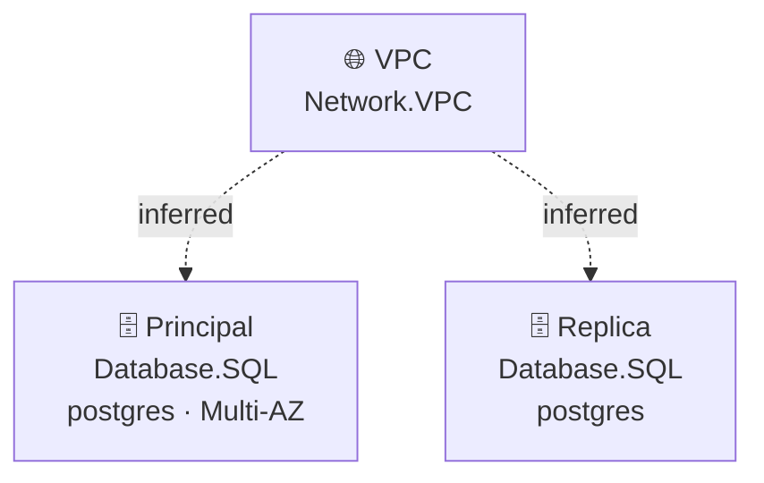

# Plano: diagramas de arquitetura a partir das stacks

## Objetivo

Adicionar um comando `iacmp diagram` que gera diagramas de arquitetura a partir das stacks existentes em `stacks/`, sem exigir que o usuário redesenhe a infraestrutura manualmente.

---

## Documentação lida

- `README.md`: comandos existentes, estrutura do monorepo, providers e constructs.
- `docs/arquitetura.md`: fluxo de `iacmp synth`, carregamento de stacks, providers nativos e plugins.
- `docs/manual-de-uso.md`: padrão de experiência dos comandos CLI.
- `docs/providers.md`: mapeamento dos constructs para AWS, Azure, GCP e Terraform.
- `docs/constructs.md`: modelo atual de `Stack`, `Compute`, `Storage`, `Network`, `Database` e `Fn`.
- `packages/cli/src/commands/synth.ts`: padrão real de leitura de `iacmp.json`, descoberta de stacks e carregamento via `ts-node`.
- `packages/cli/src/audit.ts`: `loadStacks()` compartilhado — reutilizado pelo comando `diagram`.
- `packages/core/src/stack.ts`: modelo atual de dados (`Stack` com `constructs` planos).
- Exemplos em `examples/webapp`, `examples/database` e `examples/network`.
- Structurizr DSL oficial: workspace, model, softwareSystem, container, deploymentEnvironment, views e autoLayout.
- Mermaid graph TD: sintaxe textual de grafos, renderizado nativamente no GitHub/GitLab.

---

## Leitura da arquitetura atual

Monorepo npm/Turbo em TypeScript, Node.js 20+, oclif v4 no CLI.

Pacotes relevantes para o diagrama:

- `@iacmp/core`: define `Stack` e constructs agnósticos de provider.
- `@iacmp/cli`: expõe comandos. O helper `src/audit.ts` já contém `loadStacks()` — reutilizado aqui.
- `src/diagram/`: módulo interno ao CLI (não pacote npm separado) com model e renderers.

---

## Limitação importante do modelo atual

`Stack` contém apenas `name`, `provider`, `region` e `constructs: BaseConstruct[]`. Cada construct tem `id`, `type` e `props`. Não existe relação explícita entre constructs ("Lambda usa bucket", "EC2 está dentro da VPC").

A V1 representa:

- inventário arquitetural por stack;
- agrupamento visual por tipo de construct;
- relações inferidas e marcadas como inferidas;
- limites claros sobre o que não pode ser deduzido.

---

## Decisão de estrutura: `src/diagram/` dentro do CLI

O loader de stacks já existe em `packages/cli/src/audit.ts`. Criar um pacote npm separado (`packages/diagram/`) adicionaria overhead de build e versionamento sem ganho na V1. Todo o código do diagrama fica em `packages/cli/src/diagram/`, junto com os demais helpers do CLI. Quando o Draw.io entrar e o código crescer, a extração para pacote próprio se justifica.

---

## Comando

```bash
iacmp diagram
iacmp diagram --format structurizr   # padrão
iacmp diagram --format mermaid
iacmp diagram --stack database
iacmp diagram --out diagrams
```

Defaults: `--format structurizr`, `--out diagrams`, provider e região vindos de `iacmp.json`.

---

## Saída de arquivos

Todas as stacks em **um único arquivo** por formato:

```
diagrams/
  workspace.dsl      # Structurizr: um workspace com todas as stacks
  workspace.md       # Mermaid: um bloco por stack em Markdown
```

A flag `--stack` filtra quais stacks entram no arquivo gerado. Não há um `.dsl` por stack — no Structurizr um workspace contém todos os sistemas e views de uma vez.

---

## Roadmap de formatos

| Versão | Formato | Status |
|---|---|---|
| V1 | Structurizr DSL | Implementado |
| V1 | Mermaid (graph TD em Markdown) | Implementado |
| V3 | Draw.io (XML mxGraphModel) | Planejado |

Mermaid foi incluído na V1 junto com Structurizr por ser igualmente textual, sem dependência externa, e ser renderizado nativamente no GitHub/GitLab/Notion.

---

## Modelo intermediário

Antes de renderizar, a stack é convertida para um modelo próprio que desacopla o core dos formatos de saída:

```typescript
type DiagramModel = {
  projectName: string;
  provider?: string;
  region?: string;
  stacks: DiagramStack[];
};

type DiagramStack = {
  name: string;
  nodes: DiagramNode[];
  relationships: DiagramRelationship[];
};

type DiagramNode = {
  id: string;
  label: string;
  constructType: string;
  technology: string;
  props: Record<string, unknown>;
};

type DiagramRelationship = {
  sourceId: string;
  targetId: string;
  label: string;
  inferred: boolean;
};
```

---

## Regras de inferência de relacionamento

Conservadoras para não inventar setas:

- `Network.VPC` agrupa visualmente recursos da mesma stack, mas não cria dependência forte.
- `Compute.Instance`, `Database.SQL` e `Fn.Lambda` recebem seta inferida da VPC quando há exatamente uma VPC na stack.
- Sem referência explícita entre constructs, nenhuma seta funcional ("calls", "reads", "writes") é criada.
- Relações inferidas rotuladas como `[inferred]` no DSL e `-.->|inferred|` no Mermaid.

---

## Arquitetura implementada

```
packages/cli/src/
  audit.ts               # loadStacks() compartilhado — reutilizado
  diagram/
    model.ts             # tipos DiagramModel, DiagramStack, DiagramNode, DiagramRelationship
    builder.ts           # Stack[] → DiagramModel (inferência de relações)
    structurizr.ts       # DiagramModel → Structurizr DSL string
    mermaid.ts           # DiagramModel → Markdown com blocos Mermaid
  commands/
    diagram.ts           # comando iacmp diagram
```

---

## Mapeamento Structurizr DSL

| iacmp | Structurizr |
|---|---|
| `iacmp.json.name` | `workspace` name |
| Stack | `group` dentro de um `softwareSystem` |
| Construct | `container` com tag por tipo |
| Provider/região | propriedade do `softwareSystem` |
| `construct.type` | `tags` e `technology` |
| `construct.props` relevantes | `description` curta |

Estrutura gerada:

```
workspace "<projeto>" {
  model {
    <projeto> = softwareSystem "<projeto>" {
      group "<stack>" {
        <id> = container "<label>" { ... }
      }
    }
  }
  views {
    container <projeto> "<stack>View" { ... autoLayout }
    styles { ... }
  }
}
```

---

## Mapeamento Mermaid

Cada stack vira um bloco `graph TD` dentro de um arquivo Markdown:

````markdown
## Stack: database


````

---

## Critérios de aceite da V1

- `iacmp diagram` funciona em projetos com `iacmp.json` e `stacks/`.
- Gera `diagrams/workspace.dsl` com estrutura mínima válida: `workspace { model { } views { } }`.
- Gera `diagrams/workspace.md` com blocos Mermaid por stack.
- Saída determinística: mesma stack = mesmo arquivo em qualquer execução.
- Inclui nome do projeto, provider, região, stacks e constructs.
- Tags por tipo: Compute, Storage, Network, Database, Function.
- Nenhuma seta funcional inventada sem base nos dados.
- Build sem erros TypeScript.

---

## Critérios de aceite da V3 (Draw.io)

- `iacmp diagram --format drawio` gera `.drawio` abrível no diagrams.net.
- Layout determinístico para evitar diffs ruidosos.
- Conectores inferidos com estilo diferente dos explícitos.
- Uma stack por página ou todas em multipágina.

---

## Evolução futura do core

Para diagramas mais precisos, adicionar referências explícitas entre constructs:

```typescript
new Fn.Lambda(stack, 'Api', {
  runtime: 'nodejs20',
  handler: 'index.handler',
  code: 'dist/',
  uses: [bucket, database],   // referência explícita → seta real no diagrama
});
```

Isso permitiria setas reais no Structurizr/Mermaid, auditorias mais fortes e melhoria do dashboard.

---

## Riscos e mitigações

| Risco | Impacto | Mitigação |
|---|---|---|
| Core sem dependências explícitas | Diagrama parece pobre | V1 foca inventário e agrupamento; versão futura adiciona `uses` no core |
| Draw.io XML manual é frágil | Arquivos inválidos ou diffs ruidosos | Usar XML builder e testes com fixture na V3 |
| Inferências erradas | Diagrama enganoso | Rotular todas as inferências; evitar setas sem referência |
| Structurizr CLI não instalado | Validação local opcional falha | DSL gerado sem depender da CLI; estrutura mínima verificável |

---

## Fontes externas

- Structurizr DSL: https://docs.structurizr.com/dsl
- Structurizr DSL language reference: https://docs.structurizr.com/dsl/language
- Mermaid graph diagram: https://mermaid.js.org/syntax/flowchart.html
- Draw.io source editing: https://www.drawio.com/docs/manual/advanced/diagram-source-edit/
