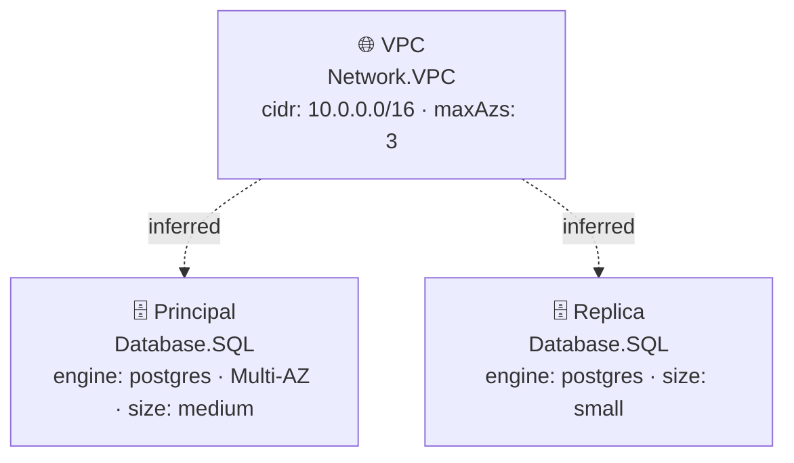

# Diagramas de Arquitetura — database

**Provider:** aws · **Region:** us-east-1

---

## Stack: database-stack

**Recursos:**

- 🌐 **VPC** `Network.VPC` — cidr: 10.0.0.0/16 · maxAzs: 3
- 🗄️ **Principal** `Database.SQL` — engine: postgres · Multi-AZ · size: medium
- 🗄️ **Replica** `Database.SQL` — engine: postgres · size: small

> Setas tracejadas indicam relações inferidas a partir da topologia da stack, não declaradas explicitamente no código.

---
