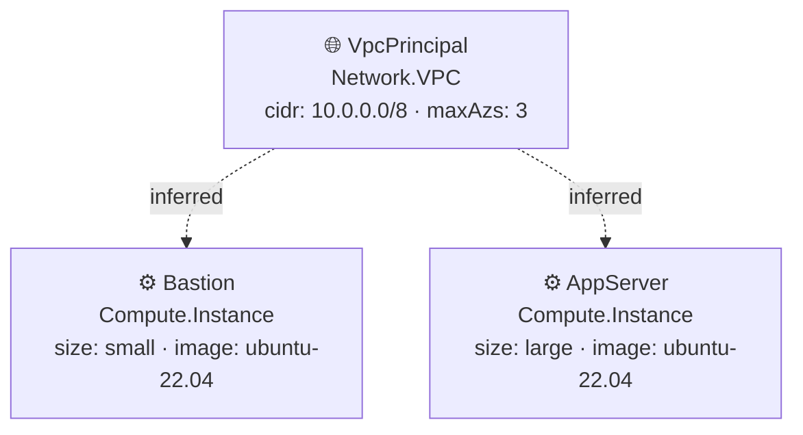

# Diagramas de Arquitetura — network

**Provider:** aws · **Region:** us-east-1

---

## Stack: network-stack

**Recursos:**

- 🌐 **VpcPrincipal** `Network.VPC` — cidr: 10.0.0.0/8 · maxAzs: 3
- ⚙️ **Bastion** `Compute.Instance` — size: small · image: ubuntu-22.04
- ⚙️ **AppServer** `Compute.Instance` — size: large · image: ubuntu-22.04

> Setas tracejadas indicam relações inferidas a partir da topologia da stack, não declaradas explicitamente no código.

---
